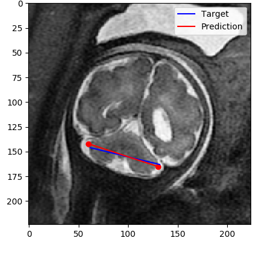
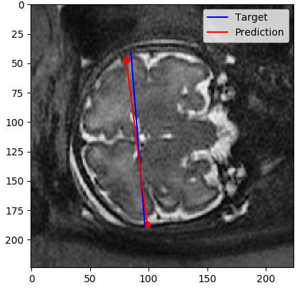
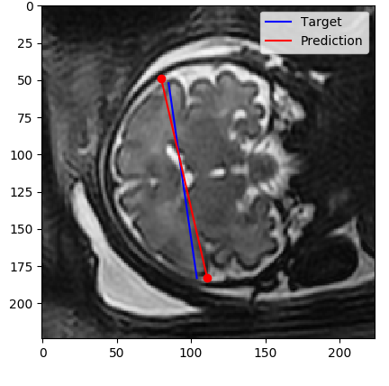

# Undergraduate Final Project: Fetal Brain Linear Measurements

## Project Overview

This README provides an explanation for the undergraduate final project conducted at the Sagol School of Neuroscience,
Tel Aviv University. 
The project focuses on developing a semi-automatic method for extracting three linear measurements of the 
fetal brain from 3D MRI scans. The measurements of interest are the Trans Cerebellum Diameter (TCD), 
Bone Biparietal Diameter (BBD), and Cerebral Biparietal Diameter (CBD). 

## Project Details

### Data and ROI Segmentation
The project requires 3D MRI scans of fetal brains along with brain segmentation.
The brain segmentation identifies the region of interest (ROI) in each scan.

### Architecture
The project utilizes a modified [HRNet](https://arxiv.org/abs/1908.07919) architecture.
The modified HRNet architecture incorporates two heads: a classification head for reference slice detection and
a landmarks detection head.

#### Slice Detection
The classification head of the HRNet model plays a crucial role in identifying reference slices.
These slices are essential for accurate linear measurements,
as they serve as points of reference for subsequent landmark detection.

#### Landmarks Detection
The landmarks detection head is responsible for identifying specific landmarks within the ROI.
These landmarks enable the extraction of the TCD, BBD, and CBD measurements.
By accurately localizing the landmarks, the system ensures precise and consistent measurement calculations.

